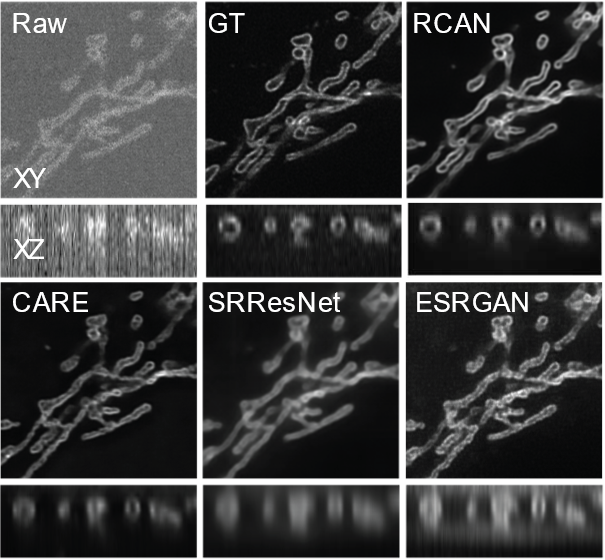

# 3D-RCAN

[](https://creativecommons.org/licenses/by-nc/4.0/)

3D-RCAN is the companion code to our paper:

[Three-dimensional residual channel attention networks denoise and sharpen fluorescence microscopy image volumes](https://www.biorxiv.org/content/10.1101/2020.08.27.270439v1).



3D-RCAN is a 3D version of deep residual channel attention network (RCAN) [[1]](#1). This model is useful for restoring and enhancing volumetric time-lapse (4D) fluorescence microscopy data.

## System Requirements

- Windows 10. Linux and Mac OS should be able to run the code but the code has been only tested on Windows 10 so far.
- Python 3.6+
- NVIDIA GPU
- CUDA 10.0 and cuDNN 7.6.5

Tested Environment:

1. Smaller RCAN (for less capable GPUs):
    - RCAN Configuration: [config.json](./config.json)
    - Windows 10
    - Python 3.7
    - NVIDIA GTX 1060 6GB
    - CUDA 10.0 and cuDNN 7.6.5

2. Larger RCAN (for better results):
    - RCAN Configuration: [config_large.json](./config_large.json)
    - Windows 10
    - Python 3.7
    - NVIDIA Tesla P100 16 GB
    - CUDA 10.0 and cuDNN 7.6.5

## Dataset

1. [Sample ER dataset and demo model](https://www.dropbox.com/sh/hieldept1x476dw/AAC0pY3FrwdZBctvFF0Fx0L3a?dl=0): This link contains a dataset, a demo model trained on that dataset, and one expected output (32-bit)

2. [Data for 3D RCAN Paper](https://zenodo.org/record/4624364#.YF4lBa9Kgal): This data release contains all training and testing data for the 3D RCAN paper. Data size: After upzip, the total size is 521 GB. Please leave enough space in the disk before unzip.Data are organized in four categories:
      - **Denoising**: It contains all training and testing data for Actin, ER, Golgi, lysosome, Microtubule, Tomm20 Mitochondria and Matrix protein Mitochondria.
      - **Phantom Spheres**: It contains training and testing data for synthetic blurred phantom sphere(2, 3 and 4 times). The ground truth is the synthetic phantom sphere without blurring.
      - **Confocal to STED**: It contains training and testing data for three different structure shown in the paper (Microtubule, nuclear pore complex and DNA). It also contains live cell data that nucleus stained by SiR for confocal to STED image modality transfer learning. Raw and GT data in the training and testing folder refer to confocal and STED images.
      - **Expansion Microscopy**: It contains training and testing data for two different structure shown in the paper. (Microtubule and Tomm20 stained Mitochondria). Raw and GT data in the training and testing folder refer to Synthetic raw and deconvolved expansion microscopy iSIM images.
      - **live cell test data Microscopy**: It contains:(1).U2OS cells transfected with matrix protein Mitochondria and Lamp1 labeled lyososome for denoising; (2). Jukat T cells transfected with EMTB-GFP for expansion microscopy.

## Dependencies Installation

3D-RCAN itself does not require installation and the dependencies installation only takes few seconds on a typical PC.

### (Option 1) Install dependencies in base environment

1. Download the [`requirements.txt`](requirements.txt) from the repository
2. In your command prompt run:

    ```posh
    pip install -r requirements.txt
    ```

### (Option 2) Create a new virtual environment

1. Download the [`requirements.txt`](requirements.txt) from the repository
2. Open command prompt and change folder to where you put the `requirements.txt`
3. Create a new virtual environment:

    ```posh
    python -m venv RCAN3D
    ```

4. Activate the virtual environment

    On Windows:

    ```posh
    .\RCAN3D\Scripts\activate
    ```

    On macOS and Linux:

    ```bash
    source RCAN3D/bin/activate
    ```

5. You should see (RCAN3D) in the command line.

6. In your command prompt run:

    ```posh
    pip install -r requirements.txt
    ```

## Training

Before you train a RCAN model, you need to create a config JSON file. Please read the following instruction and check the example [`config.json`](config.json) in the repository.

To train the RCAN model yourself, run:

```posh
python train.py -c config.json -o /path/to/training/output/dir
```

The user must specify the training data location in the input config JSON file to load the training images. We provide two ways to do so:

### (Option 1) Load images from a folder using `training_data_dir`

```javascript
"training_data_dir": {"raw":"/path/to/training/Raw/",
                      "gt":"/path/to/training/GT/"}
```

If use option 1, please make sure that Raw and GT directories contain the same number of TIFF files. TIFF files in raw and GT directories are sorted in alphabetical order by name when matching the raw/GT pairs. The file names of each raw/GT pair are output in the terminal window when loading data. Please check the output to make sure raw and GT are correctly matched.

### (Option 2) Load specific raw/grountruth image pairs using `training_image_pairs`

```javascript
"training_image_pairs": [
      {"raw": "/path/to/training/Raw/image1.tif",
        "gt": "/path/to/training/GT/image1.tif"},
      {"raw": "/path/to/training/Raw/image2.tif",
        "gt": "/path/to/training/GT/image2.tif"}
]
```

If use option 2, training data is an array of raw and GT image pairs.

Note that you can also use `training_data_dir` and `training_image_pairs` at the same time.

```javascript
"training_data_dir": {"raw":"/path/to/training/Raw/",
                      "gt":"/path/to/training/GT/"},
"training_image_pairs": [
     {"raw": "/path/to/additional/Raw/image1.tif",
      "gt": "/path/to/additional/GT/image1.tif"},
     {"raw": "/path/to/additional/Raw/image2.tif",
      "gt": "/path/to/additional/GT/image2.tif"}
]
```

### More options

Following optional variables can be also set in the JSON file (if not set, default values will be used):

- `validation_data_dir`
  
  - Paths to raw and groud truth data directories for validation
    
  - Default: None
  
    ```javascript
    "validation_data_dir": {"raw":"/path/to/validation/Raw/",
                            "gt":"/path/to/validation/GT/"}
    ```
  
- `validation_image_pairs` (array of image pairs)
  
  - Validation data on which to evaluate the loss and metrics at the end of each epoch

  - Default: None
  
    ```javascript
    "validation_image_pairs": [
         {"raw": "/path/to/additional/Raw_validation/image1.tif",
          "gt": "/path/to/additional/GT_validation/image1.tif"},
         {"raw": "/path/to/additional/Raw_validation/image2.tif",
          "gt": "/path/to/additional/GT_validation/image2.tif"}
        ]
    ```
  
- `epochs` (integer)
  
  - Number of epochs to train the model

  - Default: 300,  Range: >=1
  
    ```javascript
    "epochs": 200
    ```
  
- `steps_per_epoch` (integer)
  
  - Number of steps to perform back-propagation on mini-batches in each epoch

  - Default: 256, Range: >=1
  
    ```javascript
    "steps_per_epoch": 100
    ```
  
- `num_channels` (integer)
  
  - Number of feature channels in RCAN

  - Default: 32, Range: >=1
  
    ```javascript
    "num_channels": 16
    ```
  
- `num_residual_blocks` (integer)
  
  - Number of residual channel attention blocks in each residual group in RCAN

  - Default: 3, Range: >=1
  
    ```javascript
    "num_channels": 4
    ```
  
- `num_residual_groups` (integer)
  
  - Number of residual groups in RCAN

  - Default: 5, Range: >= 1
  
    ```javascript
    "num_residual_groups": 4
    ```
  
- `channel_reduction` (integer)
  
  - Channel reduction ratio for channel attention
  
  - Default: 8, Range: >=1
  
    ```javascript
    "channel_reduction": 4
    ```

- `data_augmentation` (boolean)

  - Enable/Disable data augmentation (rotation and flip)

  - Default: True

    ```javascript
    "data_augmentation": False
    ```

- `intensity_threshold` (number)

  - Threshold used to reject patches with low average intensity 

  - Default: 0.25, Range: >0.0

    ```javascript
    "intensity_threshold": 0.3
    ```

- `area_ratio_threshold` (number)

  - Threshold used to reject patches with small areas of valid signal 

  - Default: 0.5, Range: 0.0~1.0

    ```javascript
    "area_ratio_threshold": 0.3
    ```

- `initial_learning_rate` (number)

  - Initial learning rate

  - Default: 1e-4, Range: >= 1e-6

    ```javascript
    "initial_learning_rate": 1e-5
    ```

- `loss` (string)

  - The objective function used for deep learning training

  - Defaut: "mae", Options:  (1) “mae”= mean absolute error or (2) “mse”= mean squared error

    ```javascript
    "loss": "mse"
    ```

- `metrics` (array of strings)

  - List of metrics to be evaluated during training

  - Default: "psnr", Options: (1) “psnr”= Peak signal-to-noise ratio  and (2) “ssim”= structural similarity index measure

    ```javascript
    "metrics": ["psnr", "ssim"]
    ```

The default RCAN architecture is configured to be trained on a machine with 11GB GPU memory. If you encounter an OOM error during training, please try reducing model parameters such as `num_residual_blocks` or `num_residual_groups`. In the example [`config.json`](config.json), we reduce `num_residual_groups` to 3 to run on a 6GB GTX 1060 GPU.

The expected runtime is 5-10 min/epoch using the example [`config.json`](config.json) under a PC similar to our tested environment.

The loss values are saved in the training output folder. You can use TensorBoard to monitor the loss values. To use TensorBoard, run the following command and open [http://127.0.0.1:6006] in your browser.

```posh
tensorboard --host=127.0.0.1 --logdir=/path/to/training/dir
```


## Model Apply

We provide two ways to apply trained 3D-RCAN models

### (Option 1) Apply model to one image at a time

To apply the trained model to an image, run:

```posh
python apply.py -m /path/to/training/output/dir -i input_raw_image.tif -o output.tif
```

The best model (i.e. the one with the lowest loss) will be selected from the model folder and applied. The output TIFF file is a two-channel ImageJ Hyperstack containing raw and restored images.

### (Option 2) Apply model to a folder of images

You can turn on the “batch apply” mode by passing a foldery path to the “-i” argument, e.g.:

```posh
python apply.py -m /path/to/training/output/dir -i /path/to/input/image/dir -o /path/to/output/image/dir
```

When the input (specified by “-i”) is a folder, the output (“-o”) must be a folder too. The output folder is created by the script if it doesn’t exist yet.

You can also specify a folder where ground truth images are located. The ground truth folder must contain the same number of images as the input folder.

```posh
python apply.py -m model_dir -i input_dir -g ground_truth_dir -o output_dir
```

### All options

- `-m` or `--model_dir` (string) [required]

  - The path of the folder that contains the deep learning model to be applied

  - The model with the lowest validation loss (parsed from the file name) in the folder will be applied

    ```posh
    -m ./model_folder
    ```

- `-i` or `--input` (string) [required]

    - The path of the input raw image  

        - The output (“-o”) must be an image too

        ```posh
        -i ./raw/image000004.tif
        ```

    -  The folder path that contains input raw images 

        - The output (“-o”) must be a folder too

        ```posh
        -i ./raw_folder
        ```

- `-o` or `--output` (string) [required]

    - The path of the output image  
    
        - The input(“-i”) must be an image too
    
          ```posh
          -o ./Result/Result_image000004.tif
          ```
    
    - The path of the output folder
    
        - The input(“-i”) must be a folder too
    
          ```posh
          -o ./Result
          ```
    
- `-g` or `--ground_truth` (string)

    - Reference ground truth image. If it is set, the output TIFF is a three-channel ImageJ Hyperstack with raw, restored, and GT.
    
        - The input(“-i”) must be an image too
    
            ```posh
            -g ./GT/image000004_decon.tif
            ```
    
    - The path of the folder that constrains reference ground truth images. If it is set, each output TIFF is a three-channel ImageJ Hyperstack with raw, restored, and GT.
    
        - The input(“-i”) must be a folder too
        
            ```posh
            -g ./GT
            ```
    
- `-b` or `--bpp` (int)

    - Bit depth of the output image
    
        - Default: 32, Options: 8, 16, or 32
        
        ```posh
        -b 16
        ```
    
- `-B` or `--block_shape`(tuple_of_ints)

    - The dimensions (Z,Y,X) of the block used to divide an input image into small blocks that could fit the GPU memory

        - If not specified, the block shape is automatically determined

        - The order of the tuple: Z_size, Y_size, X_size

            ```posh
            -B 12,480,480
            ```

- `-O` or `--block_overlap_shape`(tuple_of_ints)

    - The overlap sizes (Z,Y,X) between neighboring blocks

        - Default: 2,32,32

        - The order of the tuple: Z_size, Y_size, X_size

            ```posh
            -O 4,16,16
            ```

-  `--normalize_output_range_between_zero_and_one`

  - To normalize the output intensity range to [0, 1]

    - Minimum intensity is mapped to 0

    - Maximum intensity is mapped to 1

      ```
      --normalize_output_range_between_zero_and_one
      ```

  - Combine with --bpp, for example to normalized to 16-bit  [0, 65535] 

    - Minimum intensity is mapped to 0
    - Maximum intensity is mapped to 65535

    ```
    -b 16 --normalize_output_range_between_zero_and_one
    ```

- `--rescale`

  - To perform affine rescaling to minimize the mean squared error between restored and ground truth images
  - This flag is especially useful if you want to conduct the same image quality analysis as CARE

  ```
  --rescale
  ```

- `-f` or `--output_tiff_format`(str)

  - To set output format

    1. “imagej” -  to save as ImageJ Hyperstack (XYCZT) [default]

    2. “ome” - to save as OME-TIFF (XYZCT)

       ```
       -f ome
       ```

## References

<a id="1">[1]</a>
Yulun Zhang *et al.* (2018).
Image Super-Resolution Using Very Deep
Residual Channel Attention Networks.
ECCV 2018

## License

Copyright © 2021 [SVision Technologies LLC.](https://www.aivia-software.com/)

Released under Creative Commons Attribution-NonCommercial 4.0 International Public License ([CC BY-NC 4.0](https://creativecommons.org/licenses/by-nc/4.0/))
